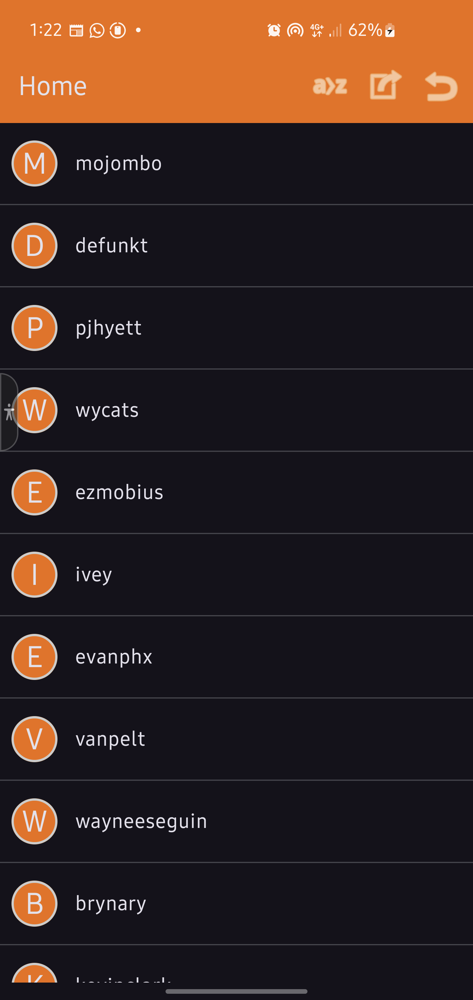

# 📱 DSA Android App

An experimental Android application built entirely using custom implementations of fundamental Data Structures and Algorithms (DSA). This project aims to reinforce understanding of core data structures by applying them in a real-world app scenario — without relying on Java's built-in data structures like ArrayList, LinkedList, Stack, etc.
🚀 Project Goals

- ✅ Build an Android app that leverages only user-implemented data structures.

- ✅ Replace all standard data structures with custom ones in the app logic.

- 📌 Encourage open-source contributions for learning, teaching, and refining DSA concepts.

- 📱 Create a fully functioning Android app where contributors can see DSA in action.

# 📂 Current Progress
✔️ Implemented

### Custom Singly Linked List

##### Features:

- `append(value)`

- `prepend(value)`

- `remove(value)`

- `pop()`

- `swap(index1, index2)`

- `reverse()`

# 🧭 Next Milestones

- 🔁 Doubly Linked List

- 🧱 Stack (built using the custom Linked List)

- 📥 Queue

- 🌳 Binary Trees (Binary Search Tree, AVL, etc.)

- 🧠 Efficient usage in real app flows (like navigation history, task queues, etc.)

# 👨‍💻 Contributing

We welcome contributors! You can:

- Implement new data structures.

- Refactor and optimize existing implementations.

- Help integrate data structures into the app's features.

- Write unit tests for reliability.

- Improve UI/UX while preserving DSA usage.

# 📌 Guidelines

- Stick to pure Java/Kotlin for DSA implementations.

- Avoid using built-in collection libraries (ArrayList, LinkedList, Stack, etc.).

- Ensure unit tests are written for new data structures.

- Follow clean code and naming conventions.

# 📸 Screenshots

  

🛠️ Tech Stack

# Language: Kotlin / Java

- Platform: Android SDK

- Testing: JUnit (for DSA structures)

# 📄 License

This project is open-source under the MIT License.
